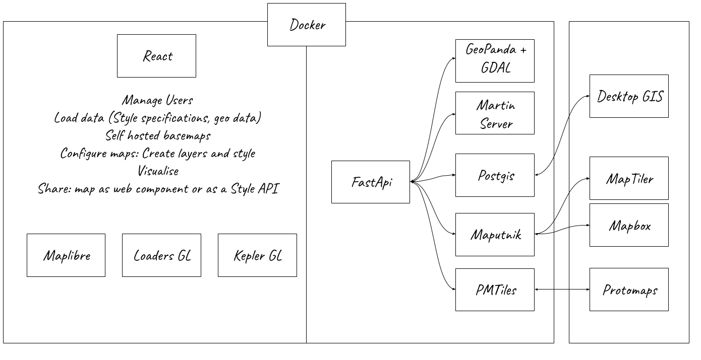

# TileCraft Project

Todo: 
* use psycopg3[async] instead of 2
* set all endpoints as async
* set singleton for config / environment variables
* Set docker images tag instead of latest
* Finish tests