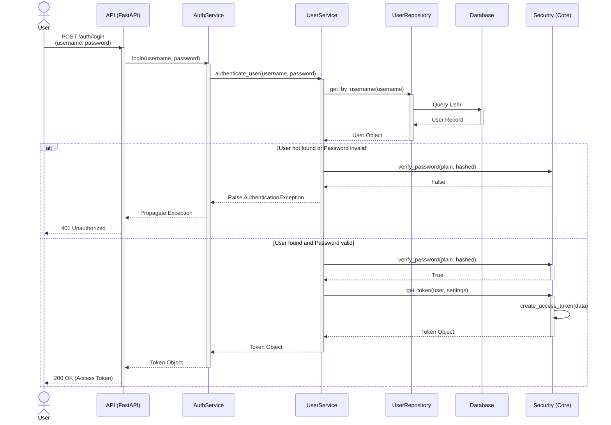

# Authentication Flow Sequence Diagram

This diagram illustrates the standard email/password login flow.

```mermaid
sequenceDiagram
    actor User
    participant API as API (FastAPI)
    participant AuthSvc as AuthService
    participant UserSvc as UserService
    participant Repo as UserRepository
    participant DB as Database
    participant Sec as Security (Core)

    User->>API: POST /auth/login<br/>(username, password)
    activate API

    API->>AuthSvc: login(username, password)
    activate AuthSvc

    AuthSvc->>UserSvc: authenticate_user(username, password)
    activate UserSvc

    UserSvc->>Repo: get_by_username(username)
    activate Repo
    Repo->>DB: Query User
    activate DB
    DB-->>Repo: User Record
    deactivate DB
    Repo-->>UserSvc: User Object
    deactivate Repo

    alt User not found or Password invalid
        UserSvc->>Sec: verify_password(plain, hashed)
        Sec-->>UserSvc: False
        UserSvc-->>AuthSvc: Raise AuthenticationException
        AuthSvc-->>API: Propagate Exception
        API-->>User: 401 Unauthorized
    else User found and Password valid
        UserSvc->>Sec: verify_password(plain, hashed)
        activate Sec
        Sec-->>UserSvc: True
        deactivate Sec

        UserSvc->>Sec: get_token(user, settings)
        activate Sec
        Sec->>Sec: create_access_token(data)
        Sec-->>UserSvc: Token Object
        deactivate Sec

        UserSvc-->>AuthSvc: Token Object
        deactivate UserSvc

        AuthSvc-->>API: Token Object
        deactivate AuthSvc

        API-->>User: 200 OK (Access Token)
    end
    deactivate API
```
