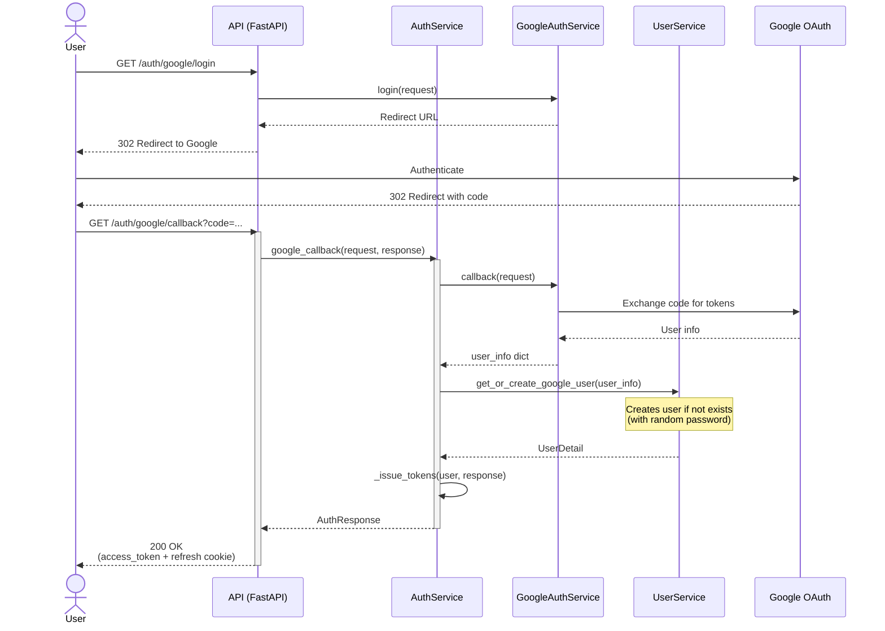

# Authentication Flow Sequence Diagram

This diagram illustrates the complete authentication flow including login, token refresh, and logout.

## Login Flow

## Token Refresh Flow

## Logout Flow

## Google OAuth Flow

