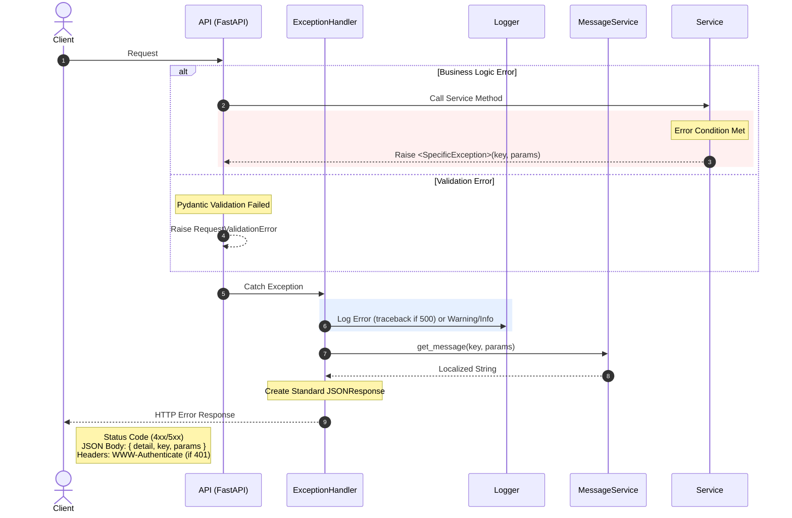
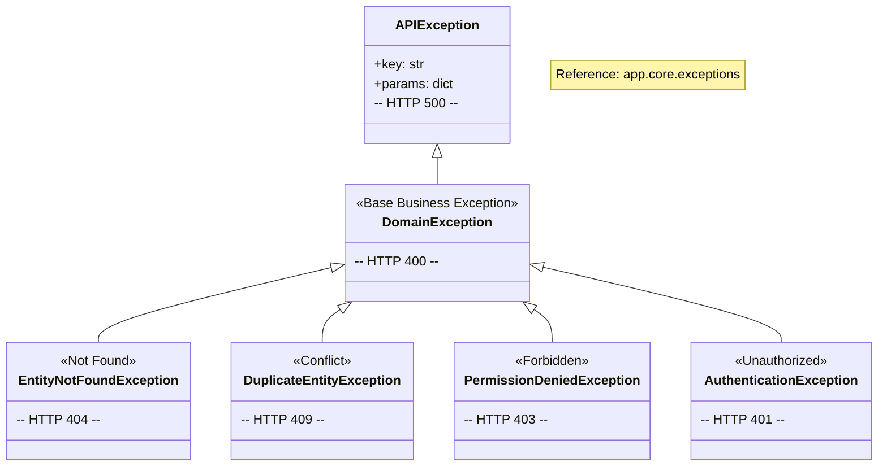

# Exception Handling Logic

## 1. Exception Flow (Logic)

This sequence diagram shows the lifecycle of an exception: from being raised in the Service Layer to being handled and returned as an HTTP response.

## 2. Exception Types (Hierarchy)

This class diagram lists the custom exceptions available in the codebase and their corresponding HTTP Status Codes.

