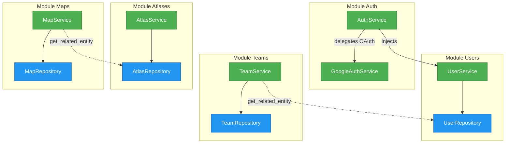

# Service Dependencies Diagram

This diagram shows the dependencies between service layers across modules.

## Dependency Matrix

| Service ↓ / Depends on → |    Users     |   Teams    | Atlases | Maps |
| ------------------------ | :----------: | :--------: | :-----: | :--: |
| **AuthService**          |  ✅ Service  |     ❌     |   ❌    |  ❌  |
| **UserService**          |      —       | Model only |   ❌    |  ❌  |
| **TeamService**          | Model/Schema |     —      |   ❌    |  ❌  |
| **AtlasService**         |    Schema    |     ❌     |    —    |  ❌  |
| **MapService**           |    Schema    |     ❌     |  Model  |  —   |

## Rules

- ✅ **Service → Service** allowed (via dependency injection)
- ✅ **Service → own Repository** required
- ✅ **Repository.get_related_entity()** for cross-module entity access
- ❌ **Service → other Repository** forbidden
- ❌ **Repository → Repository** forbidden
